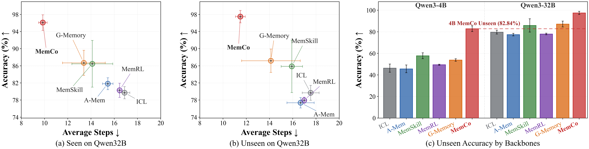

# MemCo: Memory-Centric Collaboration for Generalizing LLM Agents to Unseen Environments

This anonymous repository is the reviewer artifact for MemCo. It contains the
implementation, deterministic benchmark partitions, and reproduction entry
points used in the submitted paper. Git history, author metadata, model
weights, generated memories, logs, and machine-specific configuration are not
part of this package.

MemCo enables agents to reuse experience across environments without copying
environment-specific details into a shared memory. It maintains a local graph
for grounded interaction experience and a global graph for transferable
workflows and rules. Local candidates are abstracted, aggregated across
agents, and admitted to global memory with a one-sided Wilson lower confidence
bound. At each decision step, MemCo retrieves from both memory scopes and
adaptively composes local grounding, global workflow guidance, and failure
reflection.


## Headline results



The figure summarizes the paper's central ALFWorld result. In the two
accuracy-versus-steps panels, moving toward the upper-left means solving more
tasks with fewer environment interactions. MemCo occupies that corner on both
seen and unseen environments. The bar chart shows that the gain persists when
the policy backbone is reduced from Qwen3-32B to Qwen3-4B.

- **Qwen3-32B reaches 96.62% seen and 97.46% unseen accuracy**, while using
  only 9.71 and 11.23 average steps. Against the strongest corresponding
  baseline, G-Memory, this is a gain of **9.93 and 10.27 percentage points**
  with shorter trajectories.
- **Qwen3-4B reaches 82.84% unseen accuracy**, exceeding the strongest
  same-backbone baseline by **25.10 percentage points**. Despite using only
  one eighth of the parameters, it also surpasses Qwen3-32B ICL, A-Mem, and
  MemRL on the unseen split.
- Across FEVER, PDDL, and the seen/unseen ALFWorld evaluations in the main
  table, MemCo obtains the highest accuracy in **10 of 12 settings** and the
  fewest interaction steps in **9 of 12 settings**.
- The improvement does not come from inserting more context. Wilson promotion
  reduces the global memory from 736 to 426 records relative to empirical-rate
  promotion, while improving unseen accuracy. Adaptive composition retrieves
  only 1.70 memories per decision; fixed L5+G5 concatenation retrieves 9.99
  yet remains 16.07 percentage points lower on unseen accuracy.

Together, these results show the intended effect of memory-centric
collaboration: MemCo transfers compact, statistically supported workflows
across environments while retaining the local grounding needed for efficient
execution.

## Method overview

MemCo follows the three-stage memory lifecycle described in the paper:

1. **Local memory construction.** Each completed episode is converted into a
   graph of states, actions, outcomes, and temporal relations. The local memory
   retains concrete environment context and derives reusable patterns,
   actionable rules, and failure reflections.
2. **Progressive global collaboration.** Candidate patterns are converted to
   role-level forms, merged only when their structured keys match, and assigned
   episode-level supporting or contradicting evidence. Given supporting count
   `n+`, contradicting count `n-`, and `s = n+ + n-`, promotion uses the
   one-sided Wilson lower confidence bound with `z = Phi^-1(1-alpha)`. An
   eligible candidate is promoted when its lower bound is at least `lambda`.
3. **Query-guided memory support.** Local and global entries are ranked using
   state, phase, and goal relevance. The selected entries are filtered against
   the current state and available actions, then rendered as grounding,
   workflow, and reflection sections for next-action prediction.

The submitted configuration uses:

| Parameter | Value |
| --- | ---: |
| One-sided tail probability `alpha` | `0.05` |
| Wilson promotion threshold `lambda` | `0.35` |
| Local retrieval limit `k_l` | `5` |
| Global retrieval limit `k_g` | `5` |
| Retrieval weights in the submitted configuration | `1, 1, 1` |

The `0.25` and `0.50` thresholds are used only for the sensitivity study.

## Repository layout

```text
mas/memory/mas_memory/
  memco.py                    MemCo runtime integration
  _memco_base.py              memory lifecycle and persistence
  memco_backend/              graph construction, promotion, retrieval, routing
scripts/
  eval_collab_multidomain_global.py
                               common four-benchmark evaluation entry point
  run_memco.sh                paper-configuration launcher
  ablations/                  frozen-memory promotion analyses
  retrieval_ablations/        Eq. (11), dense, and BM25 retrieval controls
data/                         deterministic split metadata, not full runtimes
configs/                      submitted retrieval/promotion manifests
tasks/                        environments, prompts, and MAS workflows
```

## Environment

Python 3.11 is recommended. The exact environment used for the artifact is
recorded in `requirements-full-freeze.txt`.

```bash
conda create -n memco python=3.11 -y
conda activate memco
python -m pip install --upgrade pip setuptools wheel
python -m pip install -r requirements-full-freeze.txt
python -m nltk.downloader punkt punkt_tab
```

For a smaller environment that resolves compatible current packages instead
of the exact snapshot:

```bash
python -m pip install -r requirements.txt
```

Never place API credentials in source files. Export them in the shell:

```bash
export OPENAI_API_BASE="https://your-openai-compatible-endpoint/v1"
export OPENAI_API_KEY="your-key"
```

For a local Qwen3-32B vLLM server:

```bash
MODEL_PATH=/path/to/Qwen3-32B \
  SERVED_MODEL_NAME=qwen32b-api \
  bash launch/launch_qwen32_api.sh

export OPENAI_API_BASE="http://127.0.0.1:8000/v1"
export OPENAI_API_KEY="dummy"
export MODEL="qwen32b-api"
```

The launcher defaults to a 16,384-token context, matching the submitted PDDL
configuration. Hardware-dependent settings such as tensor parallelism and GPU
memory utilization can be supplied through `TP_SIZE` and `GPU_MEM_UTIL`.

## Benchmark setup

The deterministic split files used by the paper are included. See
[`data/README.md`](data/README.md) for their composition.

### ALFWorld

Download the official ALFWorld assets and expose the `json_2.1.1` directory:

```bash
export ALFWORLD_DATA="$PWD/data/alfworld"
alfworld-download --force-download --force
export ALFWORLD_GAME_ROOT="$ALFWORLD_DATA/json_2.1.1"
```

The artifact uses four room domains: kitchen, living room, bedroom, and
bathroom. It evaluates both the official `valid_seen` and `valid_unseen`
splits.

### PDDL

The four training partitions and merged 60-task evaluation set are included
under `data/pddl`. No additional dataset download is needed for the bundled
PDDL runtime.

### FEVER

The Film/TV and Music training partitions and the balanced 60-task evaluation
set are included under `data/fever`. Evaluation requires access to Wikipedia.

### ScienceWorld

`scienceworld==1.2.3` is part of the fully pinned environment. The included
partition contains ten task-family domains and a merged 60-variation test set.

## Reproducing the main method

All four benchmarks use the same launcher and the submitted Wilson settings.
Commands run in the foreground and print the fully resolved command before
execution.

```bash
bash scripts/run_memco.sh alfworld
bash scripts/run_memco.sh pddl
bash scripts/run_memco.sh fever
bash scripts/run_memco.sh scienceworld
```

The reported repeated runs use seeds `41`, `42`, and `43`. For example:

```bash
for seed in 41 42 43; do
  SEED="$seed" RUN_ID="alfworld_memco_wilson_seed${seed}" \
    bash scripts/run_memco.sh alfworld
done
```

Useful overrides include:

```bash
# Print the resolved command without executing it.
DRY_RUN=1 bash scripts/run_memco.sh pddl

# Small pipeline check.
MAX_TRAIN=1 MAX_EVAL=1 BATCH_SIZE=1 \
  bash scripts/run_memco.sh alfworld

# Select a different OpenAI-compatible model.
MODEL=qwen4b-api OPENAI_API_BASE=http://127.0.0.1:8004/v1 \
  bash scripts/run_memco.sh fever
```

The underlying entry point is
`scripts/eval_collab_multidomain_global.py`. Its MemCo defaults match the
submitted configuration (`wilson`, `alpha=0.05`, `lambda=0.35`), while the
launcher states every method-defining option explicitly.

## Outputs

Each run writes persistent memory under `.db/`, structured evaluation reports
under `Report/`, and optional logs under `logs/`. These directories are ignored
by Git. The evaluation script prints the final JSON and Markdown report paths,
per-domain accuracy or success, average step count, task count, and wall-clock
summary.

For inspection, the Wilson promotion report records the evidence counts,
lower bound, eligibility result, rejection reasons, and selected record IDs.

## Controlled studies

The paper's promotion, memory-scope, fixed-concatenation, and threshold studies
reuse one frozen ALFWorld local-memory snapshot. This prevents new trajectories
from confounding the component being changed.

- `scripts/ablations/frozen_memory_eval.py` replaces only the global admission
  criterion or reuses an already staged global memory.
- `scripts/retrieval_ablations/frozen_retrieval_eval.py` implements Eq. (11)
  masks and dense/BM25 retrieval controls without modifying production code.
- `scripts/budget_sensitivity/` contains aggregation and plotting utilities
  for the maximum-interaction-budget study.

Generated memories are intentionally not committed because they contain model
outputs and are large. First run the main ALFWorld command with a stable
`RUN_ID`, then copy that run into a new run directory before invoking a frozen
wrapper. The wrappers refuse to silently overwrite an existing target.

## Validation

The Wilson promotion unit tests can be run without contacting a model server:

```bash
OPENAI_API_BASE=http://127.0.0.1:1/v1 \
OPENAI_API_KEY=test \
python -m unittest mas.memory.mas_memory.memco_backend.tests.test_promotion
```

The tests cover known Wilson values, episode-level evidence reduction,
anti-pattern handling, serialization, legacy/shadow isolation, structural
eligibility, source-coverage diagnostics, and snapshot rebuilding.

## Scope and attribution

This reviewer package intentionally omits Git history, author information,
private credentials, machine-specific paths, checkpoints, generated memories,
logs, caches, and experiments not discussed in the submitted paper.

The implementation builds on the public
[GMemory](https://github.com/bingreeky/GMemory) research codebase and uses the
official ALFWorld, FEVER, PDDLGym-derived, and ScienceWorld environments. See
[`NOTICE.md`](NOTICE.md) for provenance and redistribution notes.
