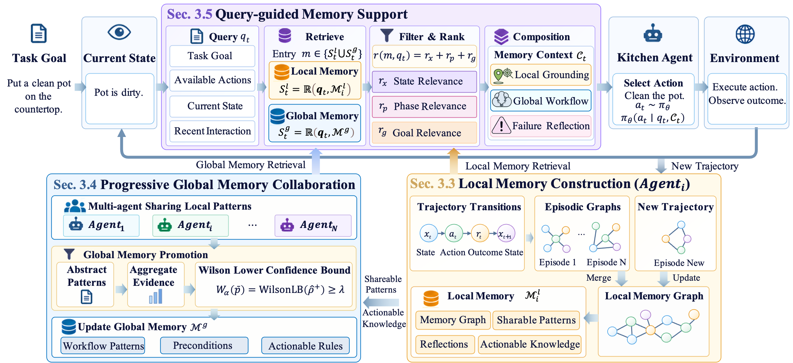

# MemCo Multidomain Evaluation

This repository contains the evaluation code for running a shared memory-enabled multi-agent system across multiple domains and benchmarks. The main reviewer-facing entry point is:

```bash
python scripts/eval_collab_multidomain_global.py
```

The script follows the same high-level protocol for every benchmark: train local memory on each source domain, merge local memories into a shared global memory, and evaluate each target split with local plus global retrieval.



## Supported Benchmarks

The multidomain script currently supports:

| Benchmark | `--dataset_family` | Domain split |
| --- | --- | --- |
| ALFWorld | `alfworld` | scene domains: bathroom, bedroom, kitchen, living |
| FEVER | `fever` | claim-topic domains |
| PDDL | `pddl` | planning-game domains |


## Data Setup

For ALFWorld, download the official PDDL game files before running evaluation:

```bash
alfworld-download --force-download --force
```

This command should place the ALFWorld assets under the configured `ALFWORLD_DATA` directory. The multidomain command should then point `--alfworld_game_root` to the downloaded PDDL JSON tree, for example:

```bash
--alfworld_game_root "$ALFWORLD_DATA/json_2.1.1"
```

## Basic Usage

All benchmarks use the same multidomain protocol. The script first builds a local memory for each source domain, then consolidates local memories into a shared global memory, and finally evaluates with both local and global memory available to the agents. This keeps the evaluation mechanism fixed while only changing the benchmark loader and data paths.

The core command shape is:

```bash
python scripts/eval_collab_multidomain_global.py \
  -dataset_family alfworld \
  --alfworld_domains bathroom,bedroom,kitchen,living \
  --alfworld_subset_dir data/alfworld/collab_subsets/v3_s \
  --alfworld_eval_split valid_seen,valid_unseen \
  --alfworld_game_root /workspace/run_alf/ALFWORLD_DATA/alfworld_official_042/json_2.1.1 \
  --mas_type autogen \
  --mas_memory memco \
  --reasoning io \
  --model qwen3-32b \
  --run_id <run_name> \
  --max_trials 30 \
  --batch_size 1 \
  --tool_mode search \
  --memco_dynamic_graph \
  --memco_settings local_plus_global \
  --memco_router textloss \
  --memco_promotion_threshold 0.35 \
  --reset_memory
```

The benchmark-specific arguments only select the dataset family and the corresponding local data files. For example, use `--dataset_family alfworld`, `scienceworld`, `scienceworld_2`, `fever` or `pddl` depending on the benchmark.

To evaluate an existing memory without retraining, rerun the command with the same `--run_id` and replace `--reset_memory` with `--eval_only`.

## Mechanism
Large language model (LLM) agents increasingly operate in interactive environments, where they need to make sequential decisions through observation, action, and feedback. Although memory can help agents reuse experience, existing work designs memory in isolation, where collecting enough trajectories to populate it is expensive Existing shared-memory approaches mitigate isolated experience by pooling episodic memories across tasks and environments. However, retrieving shared memory is challenged by the granularity, where retrieved memories can be either too specific to preserve current grounding or too coarse to support the next action. In this work, we propose MemCo, a memory-centric collaboration framework for generalizing LLM agents to unseen interactive environments. Our model organizes collaboration around the lifecycle of memory, i.e., local memory construction, asynchronous memory collaboration, and adaptive memory supporting. It maintains complementary local and global memory spaces, preserving environment-specific details locally while promoting transferable workflows induced from local trajectories to global memory. During online interaction, Memco routes relevant local and global memories in terms of the agent's current state and decision phase, enabling agents to reuse the experience of other agents without blindly transferring environment-specific details. Experiments on interactive decision-making benchmarks show that Memco improves task success and reduces redundant exploration compared with isolate-memory and shared-memory baselines.
## Outputs

Each run writes a structured report and a Markdown summary under the configured log directory. At completion, the script prints the exact `report_json` and `report_md` paths, followed by per-domain accuracy, reward, step count, task count, and wall-clock summaries.

## Acknowledgement

We sincerely thank [bingreeky/GMemory](https://github.com/bingreeky/GMemory) for providing the framework on which our architecture is based.
